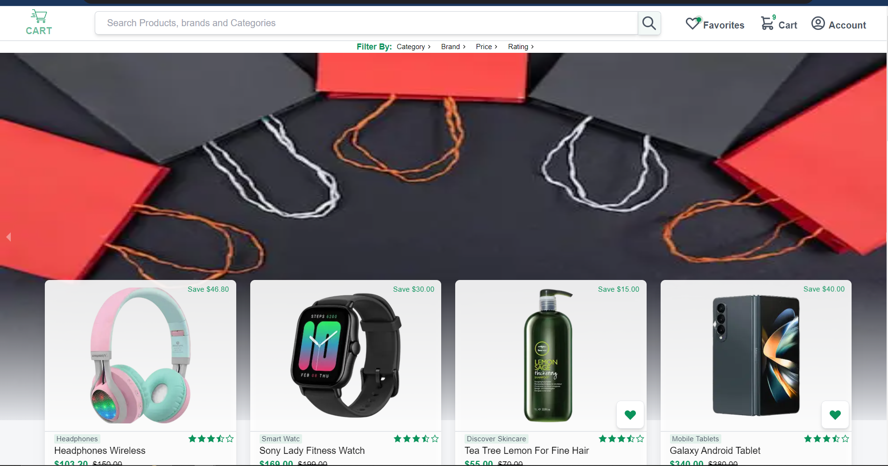
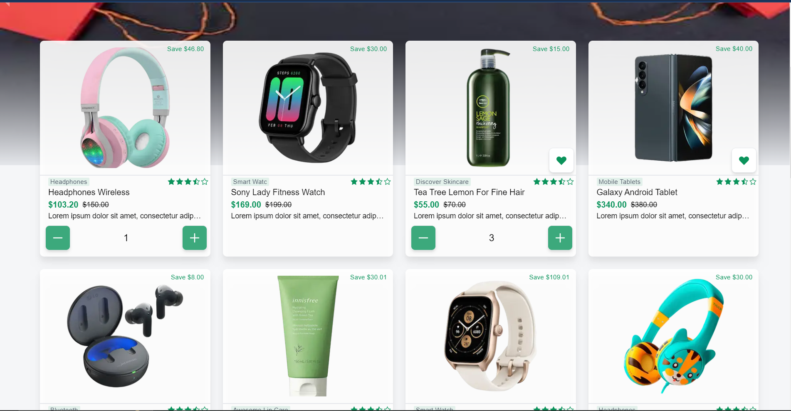
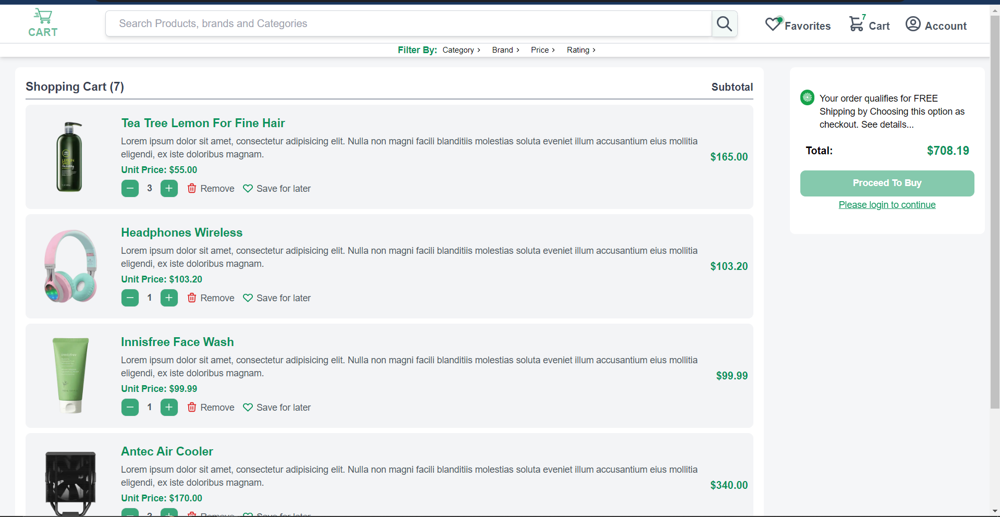
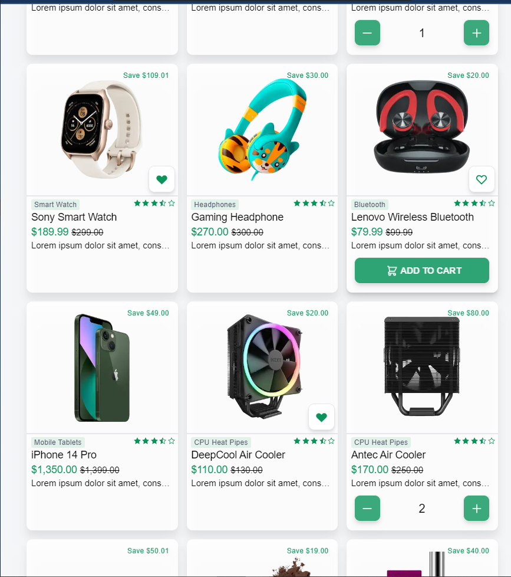
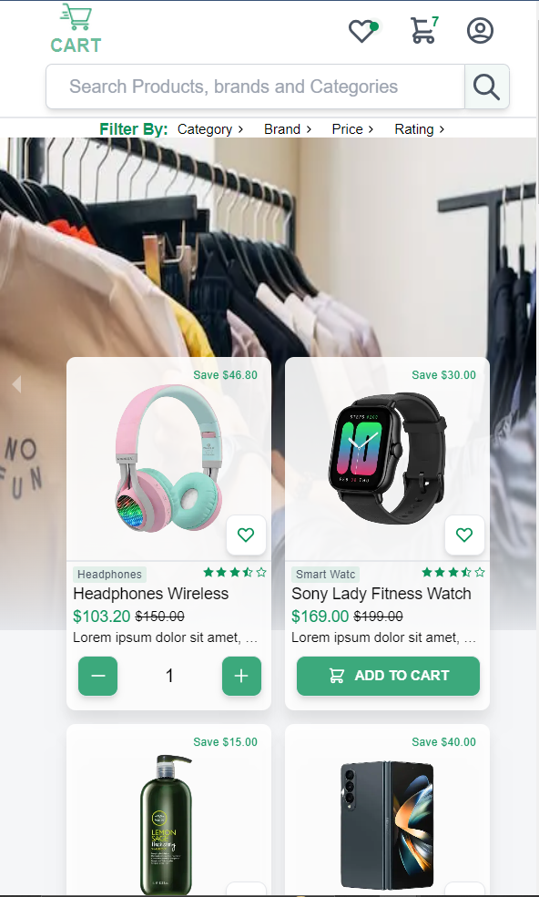
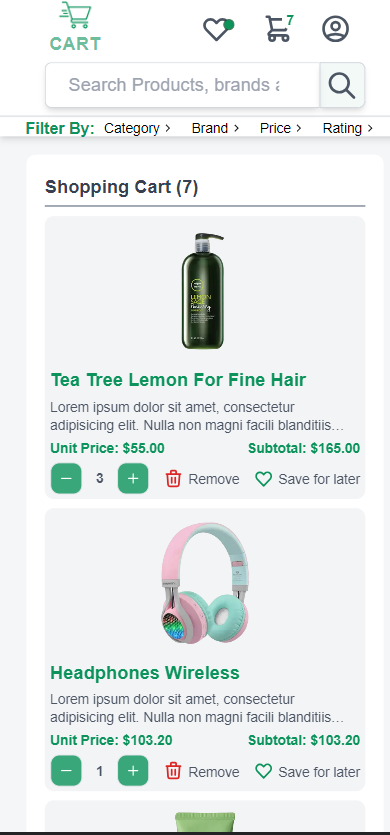

# Cart E-Commerce Website




---

## Introduction

Welcome to the Cart E-Commerce Website, a modern and user-friendly online shopping platform built using Next.js. This project utilizes a variety of technologies including TypeScript, Zustand for state management, Tailwind CSS for styling, React.js for building UI components, and React Icons for adding icons to the interface. The website aims to provide a seamless shopping experience with features like a shopping cart, favorites list, search bar, checkout/payment option, user profiles, and product pages.

---

## Author

### Ezeibekwe Emmanuel

Software Engineer (Frontend Heavy)  
📧 Email: [ezeibekweemma@gmail.com](mailto:ezeibekweemma@gmail.com)
💼 LinkedIn: [https://www.linkedin.com/in/ezeibekweemma/](https://www.linkedin.com/in/ezeibekweemma/)

---

## Features

-   Browse and shop for a wide range of products.
-   Add products to your shopping cart.
-   Remove products from your shopping cart.
-   Increase or decrease product quantities in the cart.
-   Save products to your favorites list.
-   View and manage your favorites list (under development).
-   Search for products using the search bar (under development).
-   Proceed to checkout and choose payment options (under development).
-   View and manage user profile (under development).
-   Secure user authentication (under development).
-   View detailed product information on individual product pages (under development).

---

## Installation

1. Clone the repository:

    ```bash
    git clone https://github.com/EzeibekweEmma/e-commerce.git
    ```

2. Navigate to the project directory:

    ```bash
    cd cart-ecommerce
    ```

3. Install the dependencies:

    ```bash
    npm install
    ```

4. Start the development server:

    ```bash
    npm run dev
    ```

5. Open your browser and navigate to `http://localhost:3000` to access the website.

---

## Project Structure

-   `/pages`: Contains the main pages of the website.
-   `/components`: Contains reusable components used across different pages.
-   `/store`: Contains Zustand store setup for managing global state.
-   `/styles`: Contains global styles and Tailwind CSS configuration.
-   `/public`: Contains static assets such as images.
-   `/types`: Contains TypeScript type definitions.

---

## Future Enhancements

As mentioned, there are several features that are still under development. Some of the upcoming enhancements include:

-   Favorites page to view and manage saved items.
-   Search bar functionality to easily find products.
-   Checkout and payment options for completing purchases.
-   User pages for profile management and order history.
-   Secure user authentication for personalized experiences.
-   Individual product pages with detailed information.

---

## Recent Projects

Here are some of my recent projects that showcase my MERN stack development skills:

#### 1. PropChase

-   Description: PropChase is a property rental marketplace where users can rent and list properties such as apartments, houses, or commercial spaces…
-   Technologies Used:
-   -   Frontend: React, Vite, Tailwind CSS
-   -   Backend: Node.js, Express.js
-   -   Database: MongoDB
-   -   Deployment: Vercel
-   Third modules/packages Used: MongoDB Atlas, Mongoose, Bcryptjs, JSONWebToken, Image-downloader, Multer, Date-fns, AWS-S3
-   GitHub Repository: [PropChase](https://github.com/EzeibekweEmma/PropChase)
-   Deployed Site: [PropChase](https://prop-chase.vercel.app/)

---

## App Screenshots

#### Desktop mode




#### Tablet mode




#### Mobile mode



---

## Contributions

Contributions are welcome! Feel free to open issues or pull requests if you have suggestions, bug fixes, or new features to propose.

## License

This project is licensed under the MIT License - see the [LICENSE](LICENSE) file for details.

---

Happy shopping with the Cart E-Commerce Website! If you have any questions or need assistance, please don't hesitate to reach out to us.
